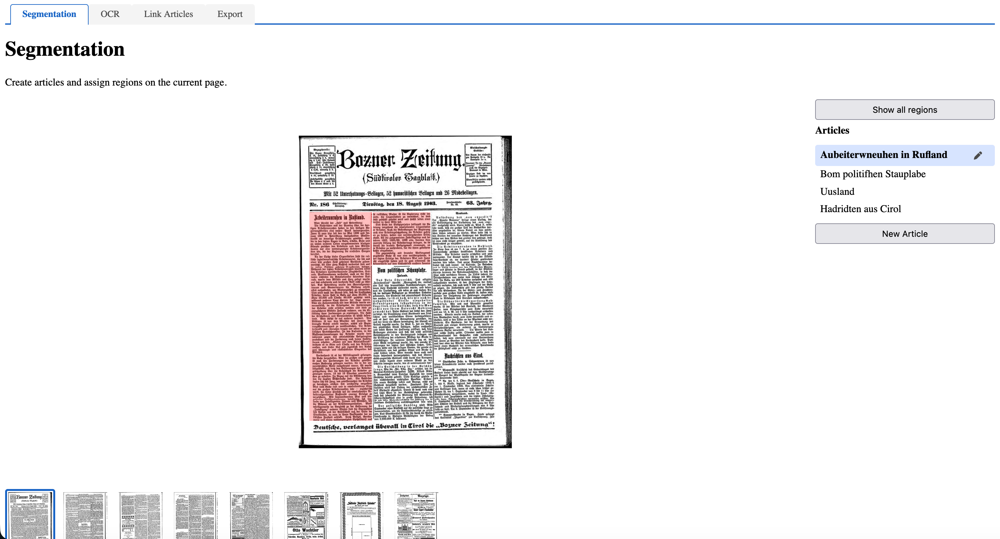

# newspaper-segmentation
Newspaper Segmentation experiments. This is intended to be a tool to create article segments and run them through OCR. It includes a Website to evaluate article boundaries and also to create articles by drawing boxes. 




## Install:

```
uv sync          # Python deps (bottle, waitress, iiif2annos, plus pytest)
npm install      # JS deps (OpenSeadragon, Annotorious, IIIF helpers)
```

Build the frontend
```
npm run build    # compiles src/main.js → app/static/js/main.js

```

## Run:
To run this project:

```
 uv run app/main.py
```


To get instant changes to the javascript while developing run this in another window:

```
npm run watch
```